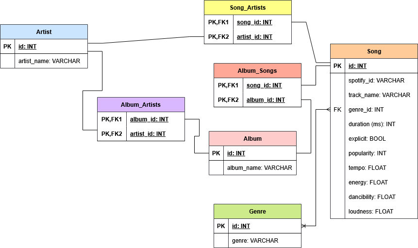
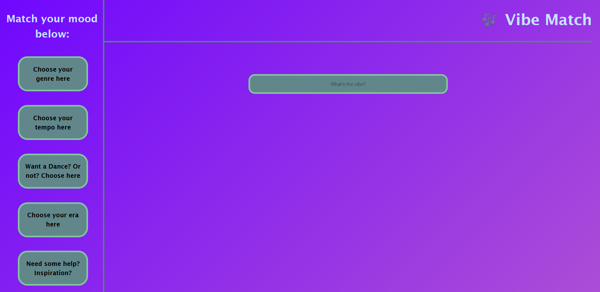

# Music Recommendation API

---

## Outline
An application that gives a user a list of songs that correspond to specified attributes, such as tempo, danceability and genre.
It is also possible to enter a Spotify id, and be given a set of song that match it's "vibe", using pre-existing attributes in a close range.

The application is connected to a database of songs, artists and albums to query the user's specifications and return back a list of similar songs they might be interested in.

This application is made with Java and Spring Boot for the backend database, and HTML, REACT and CSS for the frontend website.

This project was worked in collaboration by:
- [Lizzie](https://github.com/LizzieH97)
- [Lotanna](https://github.com/Tannababy)
- [Jude](https://github.com/sector-11)
- [Megan](https://github.com/Megan-0401)

---

## Database

The database consists of 4 main tables: songs, artists, albums and genres. For the many-to-many relationships, there are 3 connecting tables: song_artists, album_artists and album_songs.

The database uses data from [Spotify track dataset by MaharshiPandya on kaggle](https://www.kaggle.com/datasets/maharshipandya/-spotify-tracks-dataset)

---

## Frontend

### REACT / CSS

[The frontend](https://github.com/LizzieH97/vibe-match-front-end) consists of the website the user can access.

On the sidebar, the user is presented with several options of how they would like to find songs:
- Genre
- Danceability
- Tempo
- Popularity

For genre, a list of genres present in the database will be fetched and displayed in a set of buttons.

For the other choices, page will change to present the user with certain ranges of their chosen attribute. The page will then give the user a list of songs between the chosen range.

Alternatively on the main page, the user can input a Spotify id into the search bar, and receive back a list of songs with a similar 'vibe'.
This consists of looking at the song's attribute values, and presenting a list of songs that fall into a close range.

---

## Backend

### Java / Spring Boot

### SQL

In the repositories, the database is called with a set of sorted queries, finding a list of songs by:
  - genre (id)
  - artist (id)
  - a minimum and maximum danceability range
  - a minimum and maximum tempo range
  - popularity, sorted by most popular

This is a snippet of an SQL query in which a list of songs is returned by a single parameter:

    SELECT songs.* FROM songs, artists, song_artists
    WHERE song_artists.song_id = songs.id
    AND song_artists.artist_id = artists.id
    AND artists.id = :artistId

Where :artistId is a stand in for the parameter.

This is a snippet of an SQL query in which a list of songs is returned by two parameters:

    SELECT DISTINCT songs.* FROM songs, artists, song_artists
    WHERE song_artists.song_id = songs.id
    AND song_artists.artist_id = artists.id
    AND songs.danceability > :min AND songs.danceability < :max

Where :min and :max are stand ins for the parameters.

The queries are additionally sorted by a Sort parameter from the org.springframework.data.domain package.

    findSongByArtistId(Integer artistId, Sort.by("track_name");

This sorts the list by the song names, ascending.

    findSongByPopularity(Sort.by(Sort.Direction.DESC, "popularity");

This sorts the list by the song popularity, descending.